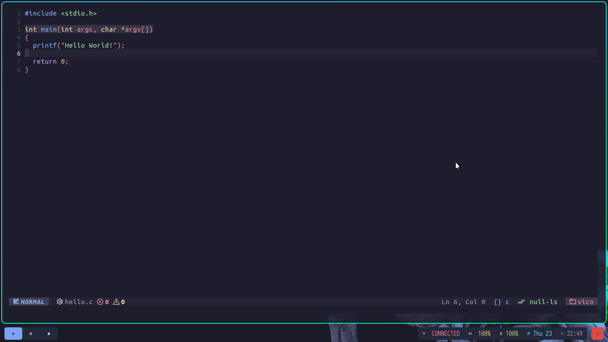

# Dotfiles for archlinux



## Install
```sh
yay -S exa bat alsa-utils ttf-iosevka-nerd ttf-ubuntu-mono-nerd waybar pipewire pipewire-pulse wireplumber yad arc-gtk-theme numix-icon-theme-git base-devel capitaine-cursors fish firefox gvfs thunar thunar-volman grimblast-git nwg-look-bin noto-fonts noto-fonts-cjk noto-fonts-emoji neovim
```

# Credits
- [lokesh-krishna](https://github.com/lokesh-krishna/dotfiles/blob/main/LICENSE) For the waybar config!
- [archcraft](https://archcraft.io/) For the scripts and some config!
