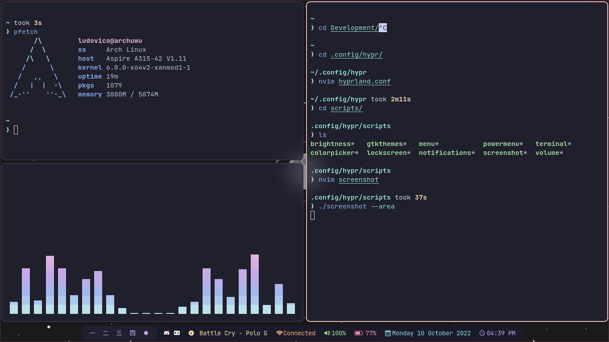

# Welcome, this is my Archlinux Dotfiles!

It's my personal dotfiles. Anything here is free to use, but I don't guarantee anything. I'm not responsible for any damage caused by these files. Use at your own risk.

## Screenshot

## Thanks to 
[Archcraft-OS](https://github.com/archcraft-os/) For the scripts 💖

[pupbrained](https://github.com/pupbrained/nix-config) For the waybar config 💖

## Contact
Discord: Ludovico#1411